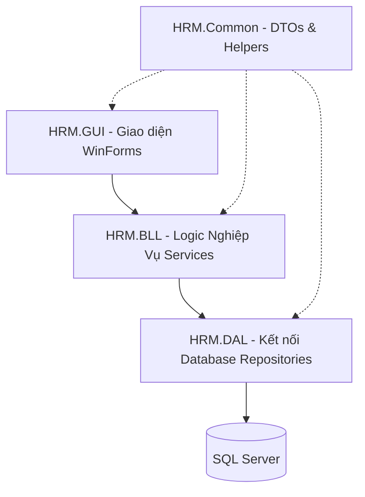

# 🚀 HƯỚNG DẪN KHỞI CHẠY & VẬN HÀNH DỰ ÁN HRM SYSTEM (.NET 8)
*Dành cho lập trình viên mới (Onboarding Developer Guide)*

Chào mừng bạn đến với đội ngũ phát triển dự án **Hệ thống Quản lý Nhân sự (HRM System)**! Dưới đây là ghi chép chi tiết, từng bước một từ khi clone code từ GitHub về cho đến khi ứng dụng chạy thành công trên máy của bạn.

---

## 🛠️ 1. Chuẩn Bị Môi Trường Hệ Thống

Trước khi bắt đầu, hãy đảm bảo máy tính của bạn đã cài đặt các công cụ sau:

1.  **Visual Studio 2022** (Phiên bản Community/Professional/Enterprise).
    *   *Lưu ý:* Khi cài đặt hoặc chỉnh sửa Visual Studio, hãy tích chọn Workload **.NET Desktop Development** (để phát triển WinForms) và **.NET 8.0 Runtime/SDK**.
2.  **SQL Server** (Có thể sử dụng SQL Server LocalDB đi kèm với Visual Studio hoặc SQL Server Express / Developer / Enterprise).
    *   Đảm bảo Service của SQL Server đang hoạt động (`Running`).
    *   Cho phép kết nối bằng quyền **Windows Authentication** (hoặc SQL Server Authentication nếu bạn muốn cấu hình riêng).

---

## 💻 2. Các Bước Khởi Chạy Dự Án (Step-by-Step)

Dự án này đã được tối ưu hóa tối đa cho nhà phát triển mới bằng cơ chế **Auto-Migration** và **Auto-Seeding** (Tự động tạo cơ sở dữ liệu và nạp dữ liệu mẫu). Bạn chỉ cần thực hiện 5 bước đơn giản sau:

### Bước 1: Mở Solution
1.  Truy cập thư mục dự án vừa clone về.
2.  Mở thư mục `db/src`.
3.  Nhấp đúp chuột vào file **`HRM.sln`** để mở toàn bộ dự án bằng **Visual Studio 2022**.

### Bước 2: Thiết Lập Startup Project
1.  Tại giao diện Visual Studio, quan sát cửa sổ **Solution Explorer** (thường nằm ở phía bên phải màn hình).
2.  Tìm project có tên **`HRM.GUI`** (đây là tầng giao diện người dùng).
3.  Nhấp chuột phải vào **`HRM.GUI`** và chọn **`Set as Startup Project`**.
4.  Bạn sẽ thấy tên project `HRM.GUI` được **in đậm** lên, báo hiệu đây sẽ là điểm bắt đầu khi chạy ứng dụng.

### Bước 3: Cấu Hình Connection String (Nếu Cần)
Dự án đã có cơ chế dự phòng kết nối tự động (`FallbackConnection`) kết nối đến SQL Server cục bộ:
*   Mặc định: `Server=.;Database=HRM_System;Trusted_Connection=True;MultipleActiveResultSets=true;TrustServerCertificate=True` (Kết nối tới instance SQL mặc định dấu chấm `.` hoặc `localhost` sử dụng Windows Authentication).

👉 **NẾU bạn sử dụng SQL Server LocalDB hoặc SQL Express khác tên mặc định:**
Hãy tạo một file `appsettings.json` nằm ngay trong thư mục gốc của project **`HRM.GUI`** với nội dung như sau:
```json
{
  "ConnectionStrings": {
    "DefaultConnection": "Server=(localdb)\\MSSQLLocalDB;Database=HRM_System;Trusted_Connection=True;MultipleActiveResultSets=true;TrustServerCertificate=True"
  }
}
```
*(Thay thế `(localdb)\\MSSQLLocalDB` bằng tên Instance SQL Server của bạn, ví dụ: `.\\SQLEXPRESS`)*

### Bước 4: Nhấn Start và Đợi Phép Màu
1.  Nhấn nút **Start (Mũi tên màu xanh lá cây)** trên thanh công cụ của Visual Studio hoặc nhấn phím **`F5`** trên bàn phím.
2.  Lúc này, Visual Studio sẽ biên dịch mã nguồn của 5 Layer.
3.  **Tự động tạo Database:** Trong lần chạy đầu tiên, mã nguồn tại `Program.cs` sẽ kích hoạt EF Core Migration để:
    *   Tạo mới hoàn toàn Database có tên **`HRM_System`** trong SQL Server của bạn.
    *   Áp dụng toàn bộ cấu trúc bảng từ các Class Entity.
    *   **Auto-Seed Data:** Nạp sẵn các vai trò (Roles), cấu hình mặc định, và tài khoản Quản trị viên mẫu.

### Bước 5: Đăng Nhập Hệ Thống
Sau khi hoàn tất quá trình khởi tạo (mất khoảng 3-5 giây trong lần đầu), Form Đăng nhập sẽ xuất hiện. Hãy đăng nhập bằng tài khoản Admin mặc định:
*   **Tên đăng nhập (Username):** `admin`
*   **Mật khẩu (Password):** `admin123`

---

## 🏗️ 3. Tìm Hiểu Cấu Trúc Dự Án (Kiến Trúc N-Tier 5 Tầng)

Để có thể bắt tay vào code mà không làm rối loạn hệ thống, bạn cần hiểu rõ vai trò của từng project (Layer) trong Solution:



| Project (Tên Layer) | Vai Trò & Nhiệm Vụ | Quy Tắc Lập Trình Quan Trọng |
| :--- | :--- | :--- |
| **`HRM.Domain`** | **Thực thể (Entities)**: Định nghĩa cấu trúc bảng Database dưới dạng Class C#. | **Cấm** viết logic xử lý, kết nối database hay thư viện ngoài ở đây. Chỉ chứa các properties định nghĩa cột. |
| **`HRM.DAL`** | **Tầng Dữ Liệu (Data Access)**: Làm việc trực tiếp với SQL qua `HrmDbContext` và các `Repository`. Cấu hình database qua Fluent API tại thư mục `Configurations/`. | **Cấm** dùng DataAnnotations (Attributes) cho các quan hệ phức tạp. Mọi cấu hình độ dài chữ, khóa ngoại, khóa chính phải nằm trong cấu hình Fluent API. |
| **`HRM.BLL`** | **Tầng Logic (Business Logic)**: Não bộ xử lý nghiệp vụ, kiểm tra ràng buộc (Validation), tính toán lương, chấm công... | Đây là nơi **duy nhất** chứa logic nghiệp vụ. Nhận dữ liệu từ GUI, xử lý xong thì gọi xuống DAL để lưu trữ. |
| **`HRM.GUI`** | **Giao diện (Presentation)**: Các Form WinForms, Controls và giao diện người dùng tương tác trực tiếp. | **CẤM TUYỆT ĐỐI** gọi trực tiếp `DbContext` hay `Repository` từ GUI. Mọi thao tác phải thông qua các `I...Service` ở tầng BLL. |
| **`HRM.Common`** | **Tiện ích chung (Shared)**: Chứa các Helper dùng chung (như mã hóa BCrypt), các DTOs (Data Transfer Objects) vận chuyển dữ liệu giữa các tầng. | Tránh thêm các dependencies phức tạp vào tầng này để giữ nó nhẹ nhàng và dùng chung tối ưu. |

---

## ⚠️ 4. Các Quy Tắc Sống Còn Cần Tuân Thủ (Strict Coding Rules)

Khi viết code mới hoặc sửa đổi code cũ, hãy luôn ghi nhớ các nguyên tắc cốt lõi sau để tránh bị leader "reject pull request":

1.  **Quy ước đặt tên (Naming Conventions):**
    *   **Interface:** Luôn bắt đầu bằng ký tự `I` (Ví dụ: `ITaiKhoanService`, `INhanVienRepository`).
    *   **Repository:** Tên class kết thúc bằng chữ `Repository` (Ví dụ: `NhanVienRepository`).
    *   **Service:** Tên class kết thúc bằng chữ `Service` (Ví dụ: `AuthService`).
    *   **Fluent API Configuration:** Tên class kết thúc bằng chữ `Configuration` (Ví dụ: `PhongBanConfiguration`).
2.  **Khóa chính (Primary Key):** Luôn đặt tên theo định dạng `Ma + [Tên Thực Thể]` (Ví dụ: `MaNhanVien` kiểu `int` tự tăng, `MaTaiKhoan`).
3.  **Tạo/Thay đổi bảng Database:**
    *   **Cấm sửa database thủ công** bằng SQL Server Management Studio (SSMS). Dự án dùng **Code-First**.
    *   Mọi thay đổi cấu trúc bảng phải được cập nhật ở `HRM.Domain`, cấu hình ở `HRM.DAL/Configurations` và chạy lệnh tạo Migration trong **Package Manager Console** của Visual Studio:
        ```bash
        Add-Migration <TenMigrationDescription> -Project HRM.DAL -StartupProject HRM.GUI
        ```
    *   Sau đó cập nhật cơ sở dữ liệu:
        ```bash
        Update-Database -Project HRM.DAL -StartupProject HRM.GUI
        ```
4.  **Bảo mật:** Mật khẩu người dùng được mã hóa tự động bằng thư viện `BCrypt.Net-Next` ở tầng Common. Không bao giờ lưu trữ mật khẩu dưới dạng văn bản thuần (Plain Text).

Chúc bạn có những trải nghiệm lập trình tuyệt vời với dự án HRM System! Nếu gặp bất kỳ khó khăn nào trong quá trình chạy thử hoặc phát triển tính năng, hãy thoải mái hỏi tôi nhé! 🚀
