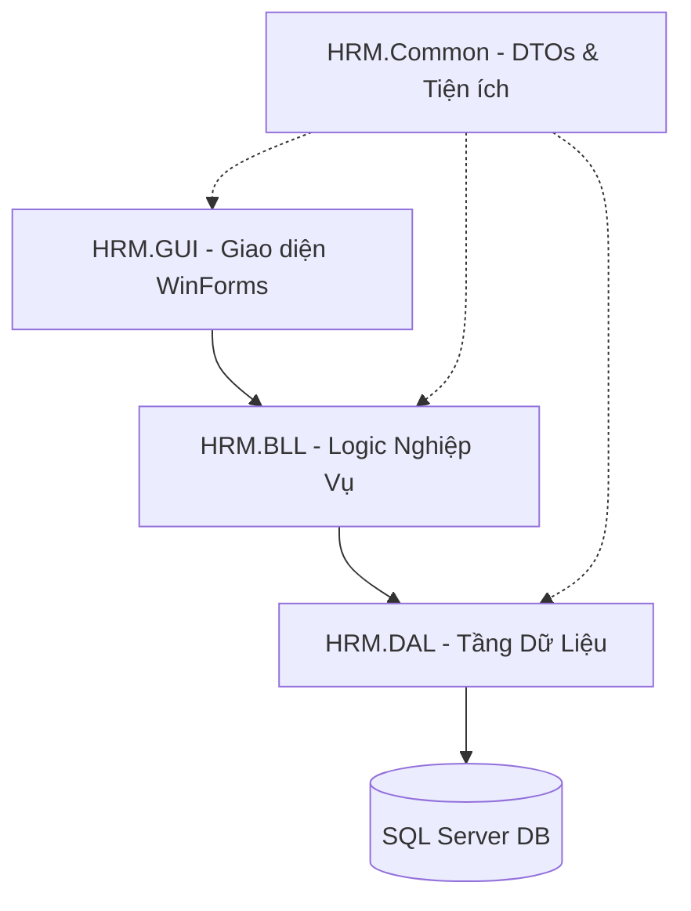
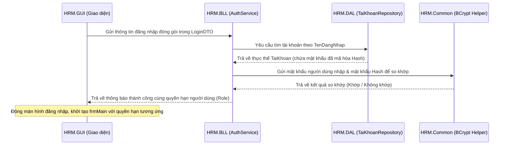

# 📘 Hệ thống Quản lý Nhân sự (HRM System)
*Hệ thống quản lý nhân sự chuyên nghiệp xây dựng trên nền tảng .NET 8 WinForms*

Chào mừng bạn đến với dự án **Hệ thống Quản lý Nhân sự (HRM System)**! Đây là một ứng dụng Desktop hiện đại được xây dựng dựa trên kiến trúc **N-Tier (Nhiều tầng)** chặt chẽ, sử dụng **Entity Framework Core (Code-First)** kết hợp với tích hợp **Trí tuệ nhân tạo Gemini AI** để tối ưu hóa hiệu suất quản trị nhân sự.

Tài liệu này được thiết kế chi tiết và dễ tiếp cận nhất để bất kỳ lập trình viên mới (Newbie) nào khi clone dự án về đều có thể nhanh chóng nắm bắt kiến trúc, cài đặt môi trường và phát triển tính năng mới một cách chuẩn mực.

---

## 🚀 1. Hướng Dẫn Khởi Chạy Dự Án (Quick Start)

Dự án sử dụng cơ chế **Auto-Migration** và **Auto-Seeding**. Hệ thống sẽ tự động kiểm tra, khởi tạo Database và nạp sẵn dữ liệu mẫu khi ứng dụng khởi chạy lần đầu tiên.

### 📋 Yêu cầu hệ thống:
*   **Visual Studio 2022** (Đã chọn Workload *.NET Desktop Development* và *.NET 8.0 SDK*).
*   **SQL Server** (Hoặc SQL Server LocalDB đi kèm với Visual Studio).

### ⚙️ Các bước thiết lập & chạy cục bộ:

1.  **Mở dự án:** Di chuyển vào thư mục `db/src` và nhấp đúp vào file **`HRM.sln`** để mở toàn bộ dự án bằng Visual Studio 2022.
2.  **Cấu hình biến môi trường cục bộ:**
    *   Trong thư mục gốc của project **`HRM.GUI`**, sao chép file `appsettings.json.example` và đổi tên thành **`appsettings.json`**.
    *   Mở file `appsettings.json` vừa tạo và cập nhật các thông tin sau:
        *   **DefaultConnection:** Thay đổi `Server` nếu SQL Server instance của bạn khác với mặc định (`Server=.`).
        *   **Gemini (ApiKey):** Điền Google Gemini API Key của bạn vào để kích hoạt trợ lý ảo hỗ trợ nhân sự (Chatbot).
3.  **Thiết lập Startup Project:** Tại cửa sổ *Solution Explorer*, nhấp chuột phải vào project **`HRM.GUI`** và chọn **"Set as Startup Project"** (Tên project sẽ được in đậm).
4.  **Chạy ứng dụng:** Nhấn nút **Start (Mũi tên xanh)** hoặc phím **F5** trên bàn phím.
5.  **Đăng nhập hệ thống:** Sau khi Form đăng nhập xuất hiện, hãy sử dụng tài khoản Quản trị viên mặc định:
    *   **Tên đăng nhập:** `admin`
    *   **Mật khẩu:** `admin123`

---

## 🏗️ 2. Cấu Trúc Dự Án (Kiến Trúc 5 Tầng Chặt Chẽ)

Dự án tuân thủ nghiêm ngặt mô hình kiến trúc **N-Tier layered architecture** gồm 5 dự án con riêng biệt. Điều này giúp tăng khả năng bảo trì, mở rộng và phân chia công việc trong nhóm một cách hiệu quả.



| Tên Project | Tầng (Layer) | Vai trò & Nhiệm vụ chính |
| :--- | :--- | :--- |
| **`HRM.Domain`** | **Entities (Thực thể)** | Nơi định nghĩa các thực thể ánh xạ trực tiếp xuống Database dưới dạng Class C# (như `NhanVien`, `PhongBan`, `ChamCong`...). Tầng này không chứa logic hay dependencies phức tạp, chỉ chứa các thuộc tính (Properties). |
| **`HRM.DAL`** | **Data Access (Tầng dữ liệu)** | Chịu trách nhiệm tương tác trực tiếp với cơ sở dữ liệu SQL Server. Chứa `HrmDbContext` (để EF Core dịch mã C# thành SQL) và các `Repository` để thực hiện các truy vấn đọc/ghi. |
| **`HRM.BLL`** | **Business Logic (Tầng nghiệp vụ)** | Bộ não của hệ thống. Chứa các `Service` xử lý mọi thuật toán, kiểm tra ràng buộc, tính toán lương, phê duyệt đơn từ dưa trên dữ liệu lấy từ DAL trước khi trả về GUI. |
| **`HRM.GUI`** | **Presentation (Tầng giao diện)** | Chứa giao diện người dùng WinForms (`frmLogin`, `frmMain`, các UserControl nghiệp vụ và Chatbot). Nhận tương tác trực tiếp từ người dùng và gửi dữ liệu xuống BLL. |
| **`HRM.Common`** | **Shared (Tiện ích chung)** | Chứa các DTOs (Data Transfer Objects) đóng gói dữ liệu trung chuyển giữa các tầng và các lớp Helper dùng chung như mã hóa mật khẩu (`PasswordHelper` dùng BCrypt). |

---

## 🔄 3. Luồng Xử Lý Dữ Liệu (Ví dụ: Chức năng Đăng nhập)

Để nắm rõ cách các tầng "giao tiếp" với nhau, hãy theo dõi quy trình hoạt động khi người dùng nhấn nút **Đăng Nhập**:



> **⚠️ BẮT BUỘC TUÂN THỦ:** Tầng giao diện (`GUI`) tuyệt đối không được gọi trực tiếp xuống `DbContext` hay các `Repository` của tầng dữ liệu (`DAL`). Mọi tương tác nghiệp vụ từ giao diện bắt buộc phải đi qua các Service ở tầng `BLL`.

---

## 🛠️ 4. Hướng Dẫn Thêm Tính Năng Mới (Mini Guide)

Khi được phân công phát triển một tính năng mới (ví dụ: *"Quản lý Thiết Bị"*), hãy thực hiện quy trình chuẩn từ dưới lên trên như sau:

### Bước 1: Khởi tạo thực thể (Domain)
Tạo class `ThietBi.cs` trong project **`HRM.Domain/Entities`** định nghĩa các thuộc tính cần quản lý:
```csharp
public class ThietBi
{
    public int MaThietBi { get; set; }
    public string TenThietBi { get; set; } = null!;
    public string LoaiThietBi { get; set; } = null!;
}
```

### Bước 2: Cấu hình ánh xạ DB & Repository (DAL)
1.  Mở `HrmDbContext` và khai báo thực thể mới:
    ```csharp
    public DbSet<ThietBi> ThietBis { get; set; }
    ```
2.  Tạo file cấu hình `ThietBiConfiguration.cs` trong thư mục `Configurations/` để thiết lập các ràng buộc (khóa chính, độ dài cột...) bằng **Fluent API** (Không dùng DataAnnotations).
3.  Tạo interface `IThietBiRepository` và lớp hiện thực `ThietBiRepository` nếu cần viết các câu lệnh truy vấn phức tạp hoặc đặc thù.

### Bước 3: Tạo và chạy Database Migration
Mở cửa sổ **Package Manager Console** trong Visual Studio, chọn dự án mặc định là **`HRM.DAL`** và thực hiện chạy các lệnh sau:
```bash
# Tạo bản ghi nhận thay đổi Database
Add-Migration ThemBangThietBi -Project HRM.DAL -StartupProject HRM.GUI

# Áp dụng thay đổi trực tiếp vào database SQL Server
Update-Database -Project HRM.DAL -StartupProject HRM.GUI
```

### Bước 4: Viết Logic Nghiệp Vụ (BLL)
Tạo interface `IThietBiService` và hiện thực `ThietBiService` trong project **`HRM.BLL`** để viết các nghiệp vụ thêm, sửa, xóa, kiểm tra logic nghiệp vụ liên quan đến thiết bị.

### Bước 5: Thiết kế Giao Diện (GUI)
Thiết kế Form hoặc UserControl trong **`HRM.GUI`**. Tiến hành tiêm DI `IThietBiService` vào Form và gọi các hàm nghiệp vụ khi người dùng click nút tương ứng.

---

## 📐 5. Quy Ước Lập Trình Dự Án (Coding Conventions)

Để giữ code sạch và nhất quán giữa các thành viên, toàn bộ đội ngũ phải tuân thủ:

1.  **Quy ước đặt tên (Naming Conventions):**
    *   **Interface:** Luôn bắt đầu bằng chữ `I` (ví dụ: `INhanVienService`, `IPhongBanRepository`).
    *   **Repository:** Tên kết thúc bằng hậu tố `Repository` (ví dụ: `NhanVienRepository`).
    *   **Service:** Tên kết thúc bằng hậu tố `Service` (ví dụ: `NhanVienService`).
    *   **Cấu hình Fluent API:** Tên kết thúc bằng hậu tố `Configuration` (ví dụ: `NhanVienConfiguration`).
2.  **Khóa chính (Primary Key):** Luôn bắt đầu bằng `Ma + [TênThựcThể]` (ví dụ: `MaNhanVien` kiểu `int` tự tăng, `MaTaiKhoan`).
3.  **Mã hóa thông tin:** Tuyệt đối không lưu mật khẩu dưới dạng thô. Luôn sử dụng `BCrypt.Net-Next` ở tầng Common để băm mật khẩu trước khi đẩy xuống database.
4.  **Thao tác Database:** Toàn bộ dữ liệu ban đầu (Seeding Data) phải cấu hình thông qua Fluent API tại `Configurations/` của tầng DAL, tuyệt đối không chèn trực tiếp bằng câu lệnh SQL ngoài tầm kiểm soát.

Chúc bạn lập trình vui vẻ và có nhiều đóng góp giá trị cho dự án **HRM System**! Nếu gặp bất kỳ vướng mắc nào, đừng ngần ngại liên hệ hoặc thảo luận cùng đội ngũ kỹ thuật nhé! 🚀
