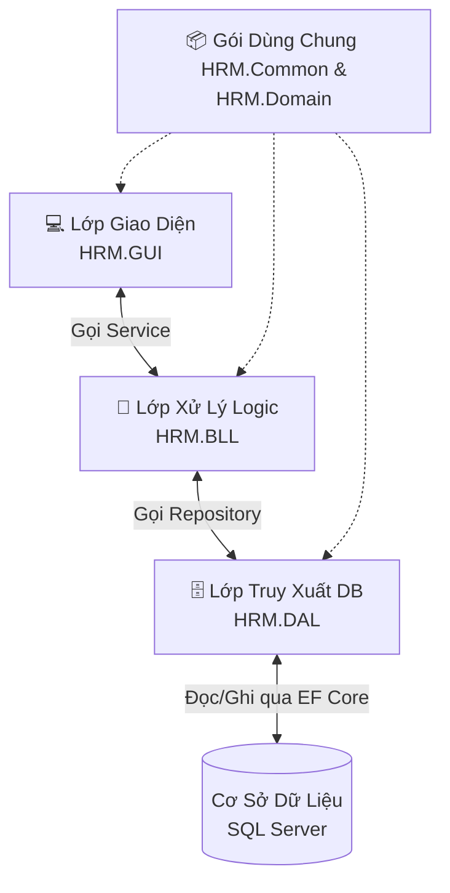

# 🚀 Tổng Quan Dự Án HRM (Quản Lý Nhân Sự)

Dự án này là một phần mềm Desktop (Windows) dùng để quản lý nhân sự cho một công ty. 

## 1. Hệ thống làm được gì? (Tính năng cốt lõi)
Hệ thống xoay quanh việc quản lý con người trong tổ chức, bao gồm các chức năng chính:
- **🏢 Phòng Ban:** Tạo, cấu trúc các phòng ban.
- **👥 Nhân Viên:** Quản lý hồ sơ, thêm/sửa/xóa nhân viên, phân bổ vào các phòng ban và chức vụ.
- **⏰ Chấm Công:** Ghi nhận giờ ra/vào làm việc hàng ngày của nhân viên.
- **🌴 Nghỉ Phép:** Quản lý quỹ ngày phép, làm đơn xin nghỉ, và quy trình duyệt phép (từ chờ duyệt -> đã duyệt).
- **🔑 Tài khoản:** Quản lý thông tin đăng nhập và phân quyền (vd: chỉ Admin mới được xóa).

## 2. Dự án được xây dựng như thế nào? (Kiến trúc 3 Lớp)
Dự án được chia thành các dự án con (modules) riêng biệt để code không bị rối, gọi là **Kiến trúc N-Tier (3 Lớp)**:

- **HRM.GUI (Presentation):** Lớp tương tác với người dùng (Windows Forms). Chỉ vẽ giao diện, nút bấm, bảng biểu. Không biết gì về Database.
- **HRM.BLL (Business Logic):** Lớp chứa "luật" của hệ thống (Services). Ví dụ: *Chỉ được xóa phòng ban nếu phòng ban đó không còn nhân viên nào.*
- **HRM.DAL (Data Access):** Lớp làm việc trực tiếp với CSDL qua kho chứa (Repositories). Dùng Entity Framework (EF) Core để biến các câu truy vấn C# thành truy vấn SQL một cách tự động.
- **HRM.Domain & HRM.Common:** Nơi định nghĩa các đối tượng (như `NhanVien`, `PhongBan`) và các gói dữ liệu truyền tải (DTOs) để các lớp trên có thể nói chung một ngôn ngữ.

## 3. Luồng dữ liệu chạy như thế nào? (Thực tế)
Hãy lấy ví dụ khi bạn bấm nút **"Xóa Phòng Ban"**:

1. **(GUI - Giao diện)**: Ở `frmMain.cs`, bạn chọn 1 phòng ban rồi bấm nút *Xóa*. Lớp này lập tức gọi `PhongBanService.DeleteAsync(ID)`.
2. **(BLL - Xử Lý Logic)**: Lớp `PhongBanService` nhận ID, nó nhờ Repository lấy thông tin phòng ban lên kiểm tra. Nếu mọi thứ hợp lệ, nó đổi trạng thái của phòng ban thành *"Đã giải thể"*. Sau đó, nó bảo Repository lưu lại.
3. **(DAL - Truy Xuất DB)**: `PhongBanRepository` nhận lệnh cập nhật. Entity Framework Core sẽ tự động viết câu SQL `UPDATE PhongBan SET TrangThai =...` và bắn xuống Database.
4. Database cập nhật thành công, báo lại tuần tự ngược lên trên.
5. **(GUI - Giao diện)**: Tải lại danh sách, phòng ban đó không còn xuất hiện.

## 💡 Chìa khóa để học dự án này
- Muốn sửa giao diện? Bật file `.cs` ở **HRM.GUI**.
- Muốn thêm điều kiện kiểm tra (vd: không cho nhân viên nghỉ quá số phép)? Vào **HRM.BLL**.
- Muốn viết câu truy vấn hoặc thêm/sửa logic lấy dữ liệu (như Tìm Kiếm)? Vào **HRM.DAL**.
- Muốn thêm cột mới vào bảng Database? Vào **HRM.Domain** sửa mô hình, sau đó cập nhật trong EF Core.
